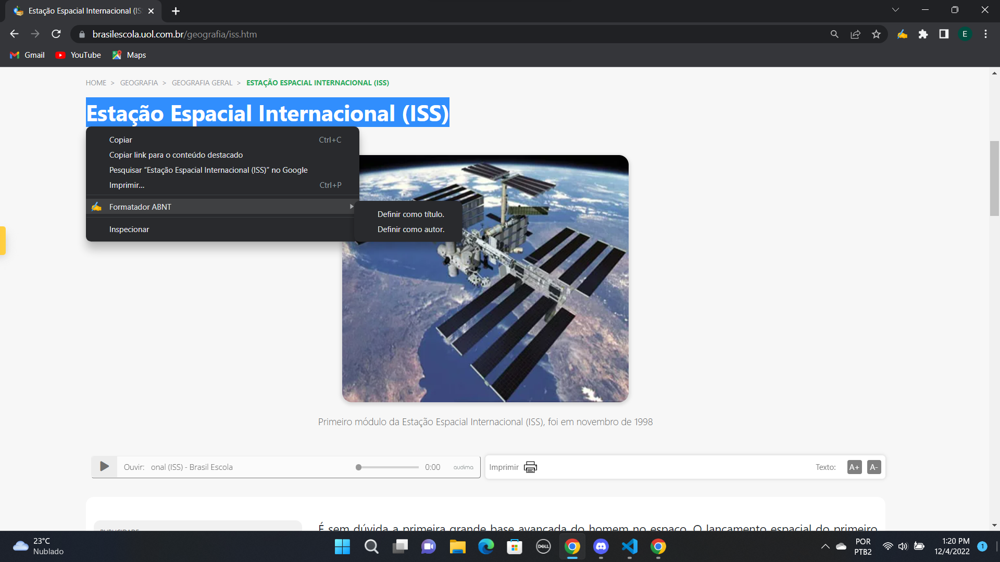
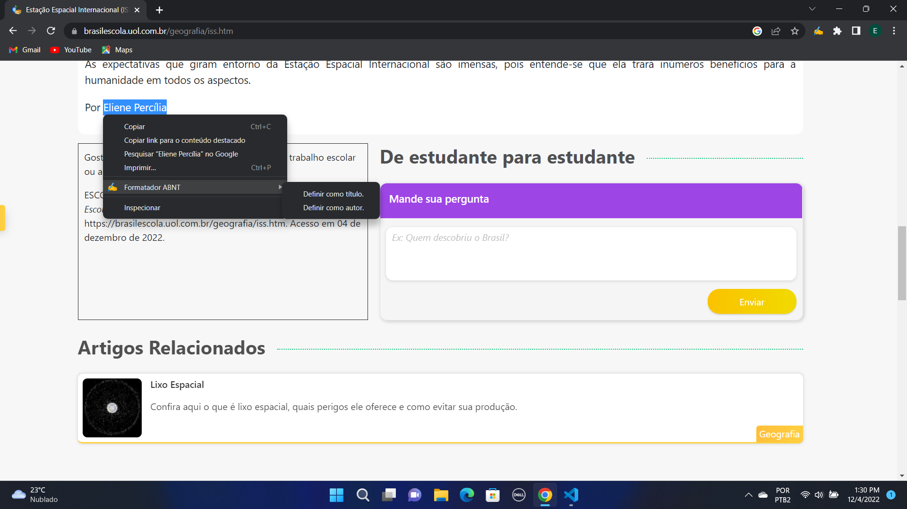
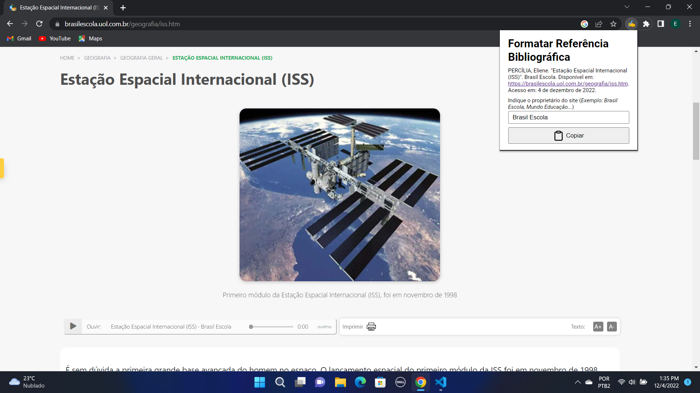

  

<h1 align="center">Formatador ABNT</h1>

Uma extensão para o Google Chrome para formatação de referências bibliográficas seguindo as normas da ABNT.

## Introdução

Não é comum, ao realizar algum tipo de trabalho acadêmico, haver a necessidade de formatar as referências bibliográficas aos padrões da ABNT. Porém, um dos grandes empecilhos gerados é a dificuldade na padronização, ou até mesmo, a ausência de ferramentas praticas que diminuam o tempo gasto em tal ação.
Pensando nisso, foi criado o "Formatador ABNT", uma extensão para o Google Chrome cujo objetivo é agilizar essa padronização, visto que o uso de websites é comum nos trabalhos acadêmicos anteriormente mencionados.

## Como usar?

Após baixar o código deste repositório em sua máquina (utilize o comando
`git clone https://github.com/edsonpetrinijr/abnt-formatter` em seu terminal ou apenas baixando o arquivo ZIP), siga o exemplo mostrado [neste](https://developer.chrome.com/docs/extensions/mv3/getstarted/development-basics/) tutorial e adicione a extensão em seu navegador.

Com a extensão devidamente instalada, acesse qualquer website que você tem interesse em utilizar como referência bibliográficas. Com o website aberto, selecione o título, clique com o botão direito do mouse, passe o mouse sobre a opção "Formatador ABNT" e clique em "Definir como título". A imagem abaixo ilustra o processo que deve ser realizado.

Após a definição do título, realize o mesmo processo com o autor. Clique com o botão direito do mouse, passe o mouse sobre a opção "Formatador ABNT" e clique em "Definir como autor".

Definido o título e o autor. Clique com o botão esquerdo do mouse sobre o ícone da extensão no canto superior esquerdo e defina o nome do proprietário do website.

Pronto! Basta clicar no botão "Copiar" e sua referência bibliográfica já está devidamente formatada.

## Autor

| [ @edsonpetrinijr](https://github.com/edsonpetrinijr) |
| :-------------------------------------------------------------------------------------------------------------------------------------------: |
